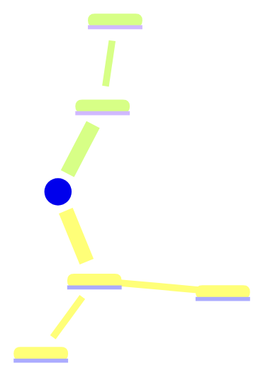

# /plan-series -- Scaffold a New Blog Series

Plan and scaffold an entire new blog series: creates a series index page, generates stub posts with full front matter, and registers new concepts in concepts.yml.

## Usage

```
/plan-series                           # Interactive: prompt for series details
/plan-series <topic>                   # Quick start with a topic name
```

## Steps

### 1. Gather Series Information

If a topic argument is provided, use it as the starting point. Otherwise, ask the user for:

1. **Series topic**: What the series covers (e.g., "Kubernetes", "System Design Interview")
2. **Number of posts**: How many posts in the series
3. **Post titles/topics**: Brief title or topic for each post (user can provide a list or let you suggest)
4. **Domain**: Which domain it belongs to -- one of: DDIA, SQL, DS, Interview, General (or a new domain)

If the user provides only a topic, suggest reasonable defaults:
- Propose 5-10 post titles based on the topic
- Suggest a domain based on the subject matter
- Show the plan and ask for confirmation before proceeding

### 2. Determine Series Metadata

Based on user input and existing blog patterns, determine:

- **Series name**: Short identifier used in front matter `series:` field (e.g., "DDIA", "SQL", "Data Science")
- **Series slug**: Kebab-case directory name for `source/series/<slug>/` (e.g., "ddia", "sql", "kubernetes")
- **Category**: Nested category array matching existing conventions:
  - `[Study Notes, Data Systems]` for distributed systems
  - `[Study Notes, Database]` for SQL/database topics
  - `[Study Notes, Data Science]` for ML/DS topics
  - `[Job Search, Software Engineering]` for interview prep
  - Create a sensible new category if none fit
- **Filename pattern**: Consistent naming for posts (e.g., `Kubernetes-Note-1.md`, `System-Design-Interview-1.md`)

### 3. Show Plan for Confirmation

Present the complete series plan to the user:

```
## Series Plan: <Series Name>

### Series Index
- Path: source/series/<slug>/index.md
- Title: "<Series Title>"

### Posts (<N> total)
| # | Filename | Title |
|---|----------|-------|
| 1 | <Filename-1>.md | <Title 1> |
| 2 | <Filename-2>.md | <Title 2> |
| ... | ... | ... |

### Front Matter Template
- Series: <series name>
- Category: [<Top>, <Sub>]
- Domain concepts to register: <count>

### New Concepts
- <concept 1> (domain: <domain>)
- <concept 2> (domain: <domain>)
- ...

Proceed? (yes/no/edit)
```

- **yes**: Create all files.
- **no**: Abort.
- **edit**: Ask what changes the user wants, update the plan, show again.

### 4. Create Series Index Page

Create `source/series/<slug>/index.md` following the pattern of existing series index pages (e.g., `source/series/ddia/index.md`):

```markdown
---
title: "<Series Title>"
date: <current date in YYYY-MM-DD HH:mm:ss format>
type: series
comments: false
---

<1-2 paragraph description of the series scope and what readers will learn.>

---

## Topic Overview



---

## Posts

1. {%% post_link <Filename-1> "<Title 1>" %%}
2. {%% post_link <Filename-2> "<Title 2>" %%}
...
```

Key requirements:
- Use `type: series` and `comments: false` in front matter
- Include a Mermaid mindmap showing the series topic structure
- Use `` tags for post links (these resolve after posts are created)

### 5. Generate Stub Posts

For each post in the series, create `source/_posts/<Filename>.md` with:

```markdown
---
title: <Post Title>
permalink: <kebab-case-slug>/
date: <current date, incrementing by 1 minute per post for ordering>
categories:
- [<Top-level>, <Sub-level>]
tags:
- <tag1>
- <tag2>
description: <placeholder -- brief description of what this post will cover>
key_concepts:
- <concept 1>
- <concept 2>
takeaways:
- <placeholder takeaway>
series: <series name>
series_index: <1-based index>
---

<Brief placeholder intro sentence about this topic.>

<!-- more -->

## TODO

This post is a stub. Fill in content for: <post topic>.
```

Key requirements:
- Use the scaffold template fields from `scaffolds/post.md`
- Set `series` and `series_index` correctly
- Use canonical concept names from `data/concepts.yml` where they exist
- Mark new concepts with `[NEW]` prefix in the plan (step 3) -- but use the plain name in the actual front matter
- Tags should be 3-6 relevant tags per post, reusing existing tags where possible
- Increment dates by 1 minute per post to maintain consistent ordering
- Include `<!-- more -->` for excerpt control
- Keep stub content minimal -- the user will fill in real content later

### 6. Update Series Master Index

Add the new series to `source/series/index.md`:

```markdown
---

## [<Series Title>](/series/<slug>/)

<1-2 sentence description of the series.>
```

Append after the last existing series entry, maintaining the same format (horizontal rule separator, h2 link, description paragraph).

### 7. Register New Concepts

For any key_concepts used in the stub posts that are NOT already in `data/concepts.yml`:

1. Show the list of new concepts to the user:
   ```
   New concepts to add to data/concepts.yml:
     - <Concept 1> (domain: <domain>)
     - <Concept 2> (domain: <domain>)

   Add these? (yes/no/edit)
   ```

2. If approved, append to the appropriate domain section in `data/concepts.yml`:
   ```yaml
   - name: <Concept Name>
     aliases:
       - <alias 1>
     domain: <DOMAIN>
   ```

### 8. Report Results

After creating all files, report:

```
[DONE] Series "<Series Name>" scaffolded successfully.

Files created:
  - source/series/<slug>/index.md (series index)
  - source/_posts/<Filename-1>.md (stub)
  - source/_posts/<Filename-2>.md (stub)
  - ...

Updated:
  - source/series/index.md (added series entry)
  - data/concepts.yml (<N> new concepts added)

Next steps:
  - Fill in post content (stubs are marked with TODO)
  - Run `hexo generate` to verify
  - Use `/blog-from-notes` to populate individual posts from raw notes
```

## Notes

- This skill creates stub posts, not full content. The user fills in content afterward.
- Use existing series (DDIA, SQL, Data Science) as reference for naming and structure conventions.
- No emoji in any output -- use text tags like [DONE], [WARN], [NEW].
- All file writes use `encoding="utf-8"`.
- When uncertain about post titles, topics, or categorization, ask the user rather than guessing.
- The series nav plugin (`scripts/series-nav.js`) will automatically add prev/next links once posts have `series` and `series_index` front matter.
- The related posts plugin (`scripts/related-posts.js`) will link posts sharing key_concepts.
