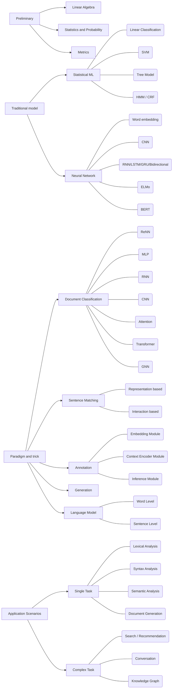

Have a glance on the NLP tasks and techniques. Will be discussed in a more detailed manner.

<!-- more -->
# General Roadmap for NLP Study

# By the way
Other roadmaps of the ML / Statistical topics would be placed here (from [reddit](https://www.reddit.com/r/MachineLearning/comments/d8jheo/p_natural_language_processing_roadmap_and_keyword/)):




