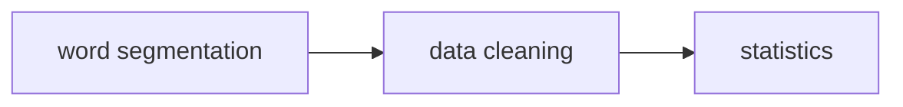
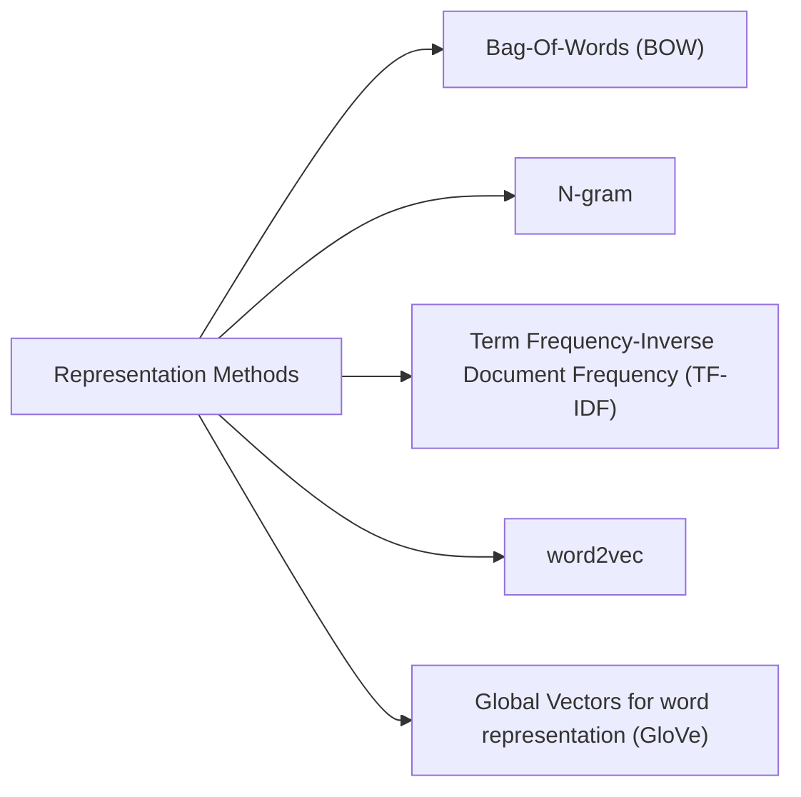

Review the major NLP tasks as well as methods (in terms of text classification).

<!-- more -->

# Abstract
The methods discussed in this survey are proposed between 1961-2021.
1. **Traditional model**: Preprocess and mannually extract features from the documents.
2. **Deep learning model**: Learns and implements the feature extraction (as non-linear transformation). Better preserve the sequential structure and contextual info.



# Traditional models
## 1 - **Preprocessing**: 

## 2 - **Word Representation**:

- **Bag-Of-Words (BOW)**: Representing each text with a dictionary-sized vector. The i-th element in the vector represents the frequency of the i-th word in the
mapping array of the sentence.
- **N-gram**: Considers the information of adjacent words to predict a word's probability. Adopts the ***Markov hypothesis***: word appears only concerning the words that preceded it. Counting and recording the occurrence frequency of all fragments (in a sliding window with size N), and predict the sentence (next word) based on the above frequency vector.
- **TF-IDF**: **TF (Term Frequency)** is the word frequency of a word in a specific article, and **IDF (Inverse Document Frequency)** is the reciprocal of the proportion of the articles containing this word to the total number of articles in the corpus. Use the **multiplication** of the two to represent a word. The importance of a word increases proportionally with the number of times it appears in a document. However, it decreases inversely with its frequency in the corpus as a whole.
- **word2vec**: 
	Use local context information to obtain (fixed-length, real value) word vectors. Two essential models: **CBOW** and **Skip-gram**. The former is to predict the current word on the premise that the context of the current word is known. The latter is to predict the context when the current word is known. 
	The two manners:
	
- **GloVe: Global Vectors for Word Representation**: Construct the co-occurrence matrix of words based on the corpus. Learn the word vector based on the co-occurrence matrix and **GloVe** model (fit the co-occurrence frequency by dot-product of vectors to measure the relevance).

## 3 - Classifiers
Finally, the represented text (vector) is fed into the classifier according to selected features.

### Probabilistic Graphical Models (PGMs) based
Express the conditional dependencies among features in graphs, such as the Bayesian network. It is a combination of probability theory and graph theory.

- **Naïve Bayes (NB)** : Assumption: when the target value has been given, the conditions between text $T = [T_1,T_2, . . . ,T_n]$ are independent. It uses the prior probability to calculate the posterior probability: $P(y|T_1, ..., T_n)=\frac{p(y)\prod_{j=1}^np(T_j|y)}{\prod_{j=1}^n p(T_j)}$. The sturcture would be quite simple (though the assumption is not actual) and would be shown below:


- **Naive Bayes Transfer Classification (NBTC)**: Use **EM Algorithm** to settle the different distribution between the training set and the target set (by obtaining a locally optimal posterior hypothesis on the target set). 
- By assuming the distribution of variables, **Bernoulli NB, Gaussian NB and Multinomial NB** can be implemented.

### K-Nearest Neighbors (KNN) based
Finding the category with the most samples on the k nearest samples.

**Possible improvements**: (metric of) feature similarity, *K* value, index optimization (accelerate the search of k nearest negihbours). 

However, this algorithm can be very **SLOW** on large datasets. The **Neighbor-Weighted K-Nearest Neighbor (NWKNN)** is proposed to improve classification on **Unbalanced** corpora (casting big weight for neighbors in a small category, a small weight for neighbors in a broad class).

### Support Vector Machine (SVM) based
Change the classification task into multiple binary classification tasks in essence (construct a optimal hyperplane to divide two classes with max distance of category boundary). 

### Decision Trees (DT) based
Supervised tree structure learning including: **Tree constrction** and **tree pruning**. The key is to divide the dataset into diverse subsets, and every leaf node stands for a category. 

The **Iterative Dichotomiser 3 (ID3)** algorithm uses information gain as the attribute selection criterion to select node / discriminant attribute.

DT based models usually need to be train on each dataset (lack of generalization ability).

### Integration-based Methods.
Aims at aggregating the results of multiple algorithms for better performance.

**Bootstrap aggregation**: **Random forest**, **Adaptive Boosting (AdaBoost)**, **XGBoost**. These classifiers are expected to be independent (combine **different** learners would be ideal).

### Summary:
**NB** assume the features are independent. It is less sensitive to missing data and simple. The performance would drop with large number of features and high correlation between features.

**SVM** can solve high-dimensional / non-linear problems. It has a high generalization but sensitive to missing data.

**KNN** depends on the finite, surrounding samples thus vulnearable in cases of crossover / overlap of the class domain.

**DT** is easy to explain, however, the feature engineering can be difficult. However, it works well on small datasets.

## Deep learning methods
Mainstream methods include **Multi-Layer Perceptron (MLP), Recursive Nerual Network (RNN), Convolutional Neural Network (CNN)**.

**Bert** is able generate the contextualized word vectors and is a significant turning point.

- **RNN**: Usually used to learn a (latent) semantic vector representative automatically (each input word would be viewed as a leaf node of the entire tree like model structure. Finally, all nodes are combined into a parent node to represent the entire input text for prediction). It can also deal with input with variable length.
- It should be noted that it is a biased model as the **following inputs profit over the former** and decreasing the semantic efficiency (**LSTM** is proposed to partially alleivated this issue). It can also be realized in a bi-directional manner.


- **CNN**: It can be implemented both in **character level** and **word level**. It can also combined with pyramid structure, residual network, etc.

- **Self-attention / Transformer / Bert**: There are alread a lot of materials on this topic.


- **Pre-trained Model**: Including models like **Embedding from Language Model (ELMo), OpenAI GPT, BERT**, etc.
We can clearly tell that ELMo is **LSTM** based while GPT and BERT are **Transformer** based.

These methods comeup with larget training time, training data and resources. A typical setting is like over 200K training sets and 1.5B training data, batch size over 8K.


We also have other models like **BART** (Seq2Seq based denoising autoencoder, introducing noise to the document and use Seq2Seq model to reconstruct) and **SpanBERT** (improved implementation of BERT, like mask a continuous paragraph, rather than word leveled. Span Boundary Objective (SBO) is added to predict span by the token next to the span boundary, and the NSP pre-training task is removed).

## GNN (Graph Neural Networks) based method
Just put a image here:


