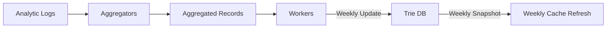
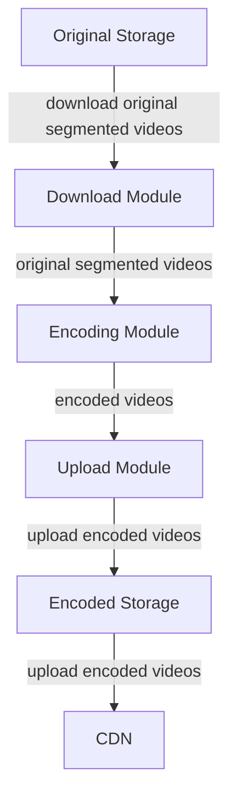

Learning note of Alex Xu's system design interview book.

<!-- more -->

# Design a Notification System
We may need to have various types of notifications, like mobile push / SMS message / Email.

## Understand the problem and establish design scope
We expect it to be soft real-time, while receiving notifications as soon as possible. We want to support iOS devices / Android deivce / laptop & desktop. Notification should be triggered by client application or can be scheduled from the server side. User should be able to choose to opt-out and estimate the number (e.g. 10M mobile push, 1M SMS messages and 5M emails)

1. **iOS push Provider**: builds and sends notification requests to *Apple Push Notification Service*, given the Device token and a JSON like Payload. Finally, iOS sys can receive the notification.
2. **Android push notification**: Firebase Cloud Messaging is commonly used.
3. **SMS Message**: Consider using third party SMS services like Twilio / Nexmo, etc.
4. **Email**: Companies can homebrew their email services or opt for commercial services like Sendgrid or Mailchimp.
5. **Contact info gathering flow**:  When user installs app or signs first time, API servers collect user contact info and stores in database (request -> load balancer -> API servers -> Database).
		Note that user can have multiple devices, by splitting user - device table, a push notification can be sent to all user devices.

6. **Notification sending / receiving flow**: 
		For the high-level design, we consider multiple services going into the notification system and then distribute to different (internal or external) services for notification serving. 

		**Service 1 to N**: A service can be micro-servce / cron job / distribute system that triggers notification sending events. 

		The **notification system** provides API for service 1-N, and builds notification payloads for third party services.

		**Third-party services**: The **extensibility** is important, making it easy to plugging or unplugging. E.g., if certain service is unavailable in new markets like China, we should find alternative.

7. A **single** notification server means single point of failure, and hard to scale the databases, caches and different notification processing components independently. Also, processing and sending notifications can be resource intensive. It may not be a good design to handle everything in a single system.
		*Improved solution*: Move the database and cache out of the notification server; add more servers and set automatic horizontal scaling; introduce message queues to decouple the system components.  

The **process** of notification sending:
[Service calls API provided by notification servers to send notifications] -> [Server fetches meta data like user info / device token / setting from cache or DB] -> [notification event to be sent to corresponding queue for processing] -> [workers pull event from queue and send to 3rd party services] -> [3rd party serve request and send to user devices]

## Design Deep Dive
### Reliability
1. **Prevention of data loss**: notification can be delayed or reordered, but never lost. We can implement a **notification log** database and have a **retry mechanism**.
2. Recipients may receive notification for **more than** once. Deduplication may be needed due to the nature of distribted system. We can check the eventID when an notification event arrives, if it is seen before, discard it. [This may be unreliable, client end failure may cause stale notification be digested]
3. We can utilize **notification template** to avoid building every notification from scratch. Then we can just customize params / styling / tracking links / etc. Example: `You dreamed of it. We dared it. [ITEM NAME] is back — only until [DATE].`
We can therefore reducing margin error and save time.
		We may need notification setting to check if user is opted-in, before actually sending such notification.
		Also, we may need to **limit** the notification frequency.
4. In case of 3rd party service failure, we need **retry** mechanism. 
5. Also we need to enhance **security** in push notification API, e.g., with the native `appKey`, `appSecret` for **authentication**.
6. We also need to **monitor** key metrics of the notification services, e.g., total number of queued notification. If it is too big, more workers are needed.
7. **Event tracking**: check the open rate / click rate / engagement, etc. We can also track potential errors and unsubscribe behavior. 

# Design a News Feed System
News feed may include updates / photos / videos / links / app activity / likes from people.
**Similar** questions: design Facebook news feed / Instagram feed / Twitter timeline, etc

Align on problem stating and scoping: 
1. Check if it is mobile / web app, or both.
2. Core features should be publishing and seeing posts on news feed page. It should be in certain order like **reverse chronological** order. Feed may contain media files.
3. Clarify on how many friends a user can have (5K), and the traffic volumn (10M DAU).

## High Level Design
1. **Feed publishing**: when user writes a post, write into caches and database. Then populate to all friends' news feed.
2. **Newsfeed building**: Just aggregate all friends' posts in reverse chronological order for simplicity. 

**API design**: should be HTTP based, allow clients to post / retrieve news feed / add friends, etc
1. Feed publishing: `POST /v1/me/feed`, with params: `content`(text of post) and `auth_token`(to authenticate) 
2. Retrievel: `GET /v1/me/feed`, also has `auth_token` as params.

Such requests should be sent to load balancer from client, then web servers can handle such requests with modules: **Post Service** (write into post cache and database), **Fanout Service** (write into news feed cache) and **Notification Service**.

### News Feeding
A user sends a request to receive news feed, portal should looks like `v1/me/feed`. Through load balancer the traffic is directed to the webserver; then query through Newsfeed service and cache to get the news feed.
For a deep dive, Web servers will further call the **Post Service** (broadcast through post cache and DB) and **Fanout Service** (delivering a post to all friends).

Web server should also enforce authentication and rate-limiting. Only allow users with valid `auth_token` to make post.

**Fanout Service**:
1. We have two modes, fanout on write (**push** mode) or fanout on read (**pull** mode).
2. For Fanout on write, news feed is pre-computed during write time, and a new post is delivered to friends cache immediately after it is published.
	**Pros**: generated in real-time, pushed immediately; fast news feed
	**Cons**: If one has many friends, it will be slow and time consuming. (**hotkey** problem); for inactive users, such strategy causes waste.
3. For Fanout on read: a on-demand model, posts are pulled when user loads home page.
	**Pros**: save resource for inactive usres; no hotkey problem
	**Cons**: Fetching news feed will be slow
4. Recommend a hybrid approach; use push model for majority of users and for celebrities, we use the pull model to make sure it is on-demand. Consisstent hashing is also useful. 
5. **Service design**: The service can get friend ids from graph db (managing friend relationship & recommendation); friends data can be stored (User - DB) (we can later filter on friends using user setting); Then we can go through the message queue - fanout workers - News feed cache (sending the friends list and new post ID (storing the post content may be too large) to the message queue, and use cache for optimizing the news feed). 
\* Uses are more likely to browse latest feeds and scrolling to thousands of news feed's chance is low.

---

***News feed retrieval***
1. **User journey**: User sends request through load balancer and web servers, then servers call the news feed service to fetch news feeds. The service will get a list of Post IDs from the cache to serve the request. A user's news feed should also contains useranme / profile picture / post content, image, etc. We can then fetch and complete post objects from cache, and return in JSON format to the client.

The cache can be further tier into 5 layers:
- Layer 1: News Feed: [News Feed *(storing IDs of News feed)*]
- Layer 2: Content: [Hot Cache *(popular content)*, Normal]
- Layer 3: Social Graph: [follower, following *(user relationship data)*]
- Layer 4: Action: [like, reply, others]
- Layer 5: Counters: [like counter, reply counter, other counters]

**Scaling** methods: Vertical scaling v.s. horizontal; SQL v.s. NoSQL; Master - slave replication; read replicas; consistency models & dataset sharding. 

**Other topics**:
1. Keep web tier stateless.
2. Cache data as much as you can
3. Support multiple data centers
4. Loose couple components with message queues
5. Kry metrics monitoring, like user behavior related performance metrics.

# Design a Chat System
Whatsapp / Facebook messenger / Wechat / Line / Google Hangout and Discord are some popular chat systems. 
It is important to nail down the exact requirement (like solo chat v.s. group chat).

**Example design scope estmatblishment**: 
It should support both 1-1 and group chat (with low latency); use multiple channels, support 50M DAU, allow 100 people in a group;
Aside from that, text length should be $\le$ 100K characters long, check if end-to-end encrption is required. Should store chat history forever.

## High Level Design
Clients should not chat to each other but should connects to a chat service. 
**Related functions**: receive messages from other clients; find right recipents, and if a recipient is not online, hold messages on server until it is back.

For staring a chat, connects the chats service using one or more network **protocols**. For a chat service, the choice of network protocols is important.

It is commmon for clients to use HTTP protocol (a fine option on the sender side) to send messages to each other, informing the service to send message to the receiver. 
\* `Keep-alive` header allows a client to maintain connection with the chat service, and reduces number of TCP handshakes.

\*\* Receiver end may be more complicated. HTTP is client-initiated, and not tirvial to send messages from server. We can simulate server-initiated connects using: **polling** / **long polling** / **webSocket**.

1. **Polling**: Periodically asks the server is there are messages available. Can be costly depending on the frequency. 
2. **Long Polling**: a client holds the connection open until there are actually new messages or a timeout threshold reached. Once the client receives new messages, it immediately sends another request to ther server to restart the process.
	**Drawbacks**: sender and receiver may not connect to the same chat server, such servers are usually stateless. E.g. if use round robin for load balancing, server received message may not have a long-polling connection with the client.
	Also, a server has no good way to tell if a client is disconnected and it is inefficient.
3. **WebSocket**: bi-directional and persisent, initiated by the client. Starts as HTTP connection and "upgraded" via well-defined handshake. 
	\*It can even work when firewall is in place, using port 80 or 332 which are used by HTTP/HTTPS connections. 

It should be noted that Websocket is implemented by serialized dataframes, with `opcode`, `payload length` and `payload data` defined. Also, client-server data must be masked while server-client data must **NOT** be masked. If not satisfying, send close frame to close connection.
For the payload length, if equals 126 then the actual length is the 2 byte (16bits) int; otherwise if it s 127 then it is 8 bytes (64bits) 

---

Then we can move to the design stage, and have 
Note that sign up / loging / user profile, etc can just use traditional request / response. We can further break down the chat system into three major cateogories: stateless service, stateful service, third-party integration. 



1. **Stateless Service**: Manage the login / signup / user profile, etc. Sits behind *load balancer*, can be monolithic or individual microservices.
	**Service discovery**: give the client a list of DNS host names of chat servers which client could connect to
2. **Stateful Service**: Chat service, which require a persistent network connection to the chat server. Since the connection usually do not switch, we need service discovery to avoid server overloading.
3. **Third party integration**: *Push notification* is the most important third-party integration.
4. **Scalability**: The number of concurrent connections that a server can handle will most likely be the limiting factor. For 1M concurrent users, each needs 10K memory on server (depending on language choice), only needs 10GB of memory. 
	However, such design is usually deal breaker mainly due to **single point of failure** concern.

Client should maintain a persistent *WebSocket* connection to chat server for real-time messaging. 
Chat servers facilitate message sending / receiving, presence servers manage online / offline status. API services handle login / signup / profile and notification sends push. **KV storage** is used to store chat history, so when offline user comes online she can check history.

**Storage**:
1. **Data types**: **generic data** (user profile / setting / friend list..) and **chat history** (big amount, only recent chats are accessed frequently; need random access of data for search, mentions or jump to specific messages).
2. Use data type and read - write patterns to support the data access layer. Read - write ratio should be ~1:1 for 1-1 chat apps.
3. We recommend **KV store** because:
	Enables easy horizontal scaling; low latency; handle long tail data well and random access; adopted by existing chat applications, like `HBase` and `Cassandra`

---

### Data Models
1. For 1-1 message, should contain `message_id` (bigint), `message_from`, `message_to`, `content` (text) and `created_at` (timestamp)
2. For group chat, we should instead have `channel_id` aside from the message id.
3. `message_id` should be **unique** and **increase** by time.
4. For simplicity, we can run a local sequence generator, becuase we only need *local* IDs when maintaining 1-1 channel or group channel.

## Design Deep Dive
### Service Discovery
Recommend the best chat server for a client, based on geographical location, server capacity, etc.

**Apache Zookeeper** is popular open-source solution for service discovery. It registers and picks best chat server for predefined critieria. 
First time login will go thorugh load balancer and API servers, then Zookeeper will pick the best server which will build **WebSocket** connection with the client.

### Message Flows

For **1-1** Chat case:
	User A sends a message, and the server will obtain a message ID from generator, then sends to message sync queue (across chat servers). Message will also be stored in key-value store. If user B is online, message will be forwared to server where B locates; otherwise a push notification is sent to **Push Notification** (PN) server.

Multiple Device Message **Synchronization**:
	Each device will build a WebSocket connection with the same chat server. Each device maintains a variable named `cur_max_message_id` and use that to track the latest messageID on the device. When message arrives and recipient ID is equal to currently logged-in user and the message ID is greater than ``cur_max_message_id`, forwarding will happen.

**Group Chat**:
	Message from sender will be copied to each group member's message sync queues. 
	\* This design only works for small group chat (to store a copy in each recipient's inbox). **Wechat** therefore limits group to be 500 members.

	On recipient side, a recipient can receive messages from multiple useres, and has an inbox storing messages from different senders.

**Online Presence Indicator**:
	Show a green dot next to a user's profile picture or username. After a WebSocket connection is built, user's online status and `last_active_at` timestamp can be stored into KV store. Presence Indicator shows the user is online. 
	When user logs out, the API servers will notify the presence servers and change to offline in KV store.

**User disconnection**:
	When user disconnects, it may not be a good idea to immediately marks him as offline (e.g., when going through a tunnel). Therefore, we should avoid changing presence indicator too often. 
	We can introduce a **heartbeat** mechanism to solve this. Online client can send a heartbeat periodically to presence servers, and use that to determine online status.
	**Online status fanout**: With a **publish-subscribe** model, each friend maintains a channel. When a friend's status changes, events will be published to channels which are subscribed by friends. 
	For very big group, we can fetch online status only when a user enters a group or manually refreshes the friend list.

### Extensive Discussion TOpics
1. Support for media files. Can discuss compression / cloud storage / thumbnails for large files.
2. End-end encryption.
3. Caching messages on the client-side is effective to reduce the data transfer.
4. Improve load time. Slack built a geographically distributed network to cache user's data, channels for better loading time.
5. Error handling: including chat server error and message resent mechanism (retrying & queueing)

# Design a Search Autocomplete System
Auto-complete: during search, show more related search terms. Also called typeahead, search-as-you-type, incremental search. 

### Problem Formulation
The matching should only be supported at the beginning of a search query, rather than in the middle (?), and top K suggestions should be returned by the system, ranking by historical query frequency. We can also consider if spell check may be needed, and if we need multi-language support / upper-lower case / special character support. This product may expect 10M DAU.

Take Facebook as an example, we usually needs an SLA of 100ms to avoid stuttering. Suggestions should be **relevant**, sorted by **popularity** and **scalable** to handle high traffic volume. Such system should be highly available even part of the system is offline. 

**Numbers**: for 10M DAU, 10 searches per user per day, 20 bytes for average query string size (assume 1 character=1byte, query contains 4 words each with a length of 5).
For every character entered into the search box, a client sends a request to the backend for autocomplete, then we may have 10M * 10 (queries per day) * 20 characters / 24 hrs / 3600 = 24K QPS. 
Peak QPS ~ 48K. Assume 20% of daily queries are new, then we will have 0.4GB new data added to storage daily.

### High Level Design
We can break the system into: **data gathering** service (gather user inputs for triage) and **query** service (return 5 most frequently searched terms given a prefix). 

For a prototype, we can write a SQL to get the most frequent complement like: `WHERE query LIKE prefix% ORDER BY frequency DESC`. However, this solution only works when dataset is small.

Further optimization will be discussed below:

**Trie data structure**: 
Trie - prefix tree can be used for optimization. With the above assumptions, we can let each tree node storing a character and has 26 children (the lower class chars). Each tree node can thus represents a single word or a prefix string.
Also query frequency needs to be included in nodes.

For a prefix with length $p$, and total number of $n$ nodes in a trie, we first find the prefix using $O(p)$. Then we can get the children and sort them using complexity of $O(c) + O(clogc)$ (c is the number of children).
However, in worst case, we will need to traverse all the childrens of root! We can then:
1. Limit max length of a prefix, e.g., 50.
2. Cache top search queries at each node (as 5 or 10 completion is good enough) (using prefix as key).

After the optimization, we should have $O(1)$ complexity for finding prefix, and another $O(1)$ retriving from cache. If there is a miss, we still need $O(clogc)$

**Data Gathering Service**:
Update data in real-time may not make sense, as users may enter a lot of queries per day, and top suggestions may not have hugely on a daily basis (for Google).
\* For twitter, it still makes sense to do it in real time.
The underlying foundation remains the same, usually from analytics or logging services.

- *Analytic logs*: append-only, not indexed.
- *Aggregators*: merge and format data (adding frequency column). If real-time is needed, we can aggregate data in a shorter time interval. Now we assume these data to be refreshed weekly (trie to be rebuilt)
- *Workers*: perform asynchronous jobs, build trie data structure and store in trie db.
- *Trie Cache*: distributed cache system, keeps trie in memory, takes a weekly snapshot of DB.
- *Trie db*: persistent storage. Can choose between **document** storage (serialized data like MongoDB) or **key-value** storage (map to hash table). Every prefix is then mapped to a key in hash.

To provide such service, user's query goes through load balancer into API servers, trie caceh and eventually into trie DB.
Query service requires fast reaction, we propose the following optimization:
1. AJAX request: sending or receiving a request/response does not refresh the whole web page.
2. Browser caching: if the auto-complete suggestion won't change a lot, we can just save it in browser cache (stay for sth like 1 hour).
3. Data sampling: we do not need to record all the logs but only a sample of it.

**Trie operations**:
Usually the trie has to be refreshed as a whole (weekly).This is slow in most cases. 
We can only update individual trie node (and all its ancestors in cache).

**Delete**: we can use a filter layer to flexibly remove data from trie. Meanwhile, we can remove unwanted suggestions physically from the database asynchronically.

**Scale the storage**:
For lower class english words, we can naturlaly shard based on first character. This leads to uneven distribution. Then we can analyze historical distribution and then apply smarter sharding (to have a shard map / lookup service). E.g., u to z may be combined.

## Extension and Discussion Topics
1. To support multiple languages, we can use Unicode as the encoding format.
2. If the distribution differs for different countries, we can store tries in CDNs.
3. Real time update: we can reduce the working dataset by sharding; change the ranking model and assign more weight to recent search quries; data may be streaming, so we can use specialized systems for that.

---

# Design Youtube
As of 2020, it has 2B users and 5B videos watched per day. 50M creators on youtube and 73% of US adults use Youtube, takes 37% of all mobile internet traffic, available in 80 languages.

**Requirements**: large, internatial user groups. Should be able to upload videos fast, smooth video streaming, change between video quality, low infra cost, high availability, scalability, reliabitliy; multiple channel supports.

**Back of the envelop estimation**: 5M DAU, watch 5 videos per day, 10% users upload 1 video perday; average video size=300M, total daily storage: 5M * 10% * 300 M = 150TB

CDN cost: charge by data transferred out of the CDN, $0.002 per GB (AWS). 5M * 5 * 0.3GB * $ 0.02=$150,000 daily.

### High Level Design
Why we cannot build everything from scratch?
1. Interviewing timeframe is limited; for storage of videos, mentioning blob storage is good enough (no need to further discuss the detailed design)
2. Building scalable blob storage / CDN is extremely complex and costly. Even large companies do not build everything themselves.

In high level, **Clients** watch Youtube on computer, mobile phone and smart TV; **CDN** stores the video and streams it; **API services** handles everything else except video streaming, like feed recommendation; video upload URL; database meta data. caching, user sign up.

**Video Uploading Flow**:


Through load balancer and API servers, the request reaches metadata cache (we can cache video metadata as well as user objects) and DB.
**Original storage** is a blob (Binary Large Object) storage system storing original videos. It transfers data to **Trasncoding / Encoding** Servers for format converting and provides video streams for different device / bandwidth capabilities.
The encoded results can be stored in **Transcoded** storage and then sent to **CDN**.
After the encoding / transcoding finisihes, a message queue sends completion event to completion handler to update metadata cache and database.

Video uploading includes: a. Upload the actual video b. Update video meta data, including video URL, size, resolution, format, user info, etc.
API servers can inform client after the video is successfully uploaded and ready for streaming. 

### Video streaming flow:
Users should be able to load a little bit of data at a time to watch videos immediately and continuously. 

**Streaming protocals**:
- MPEG-DASH: (Moving Picture Experts Group) and (Dynamic Adaptive Streaming over HTTP)
- Apple HLS (HTTP Live Streaming)
- Microsoft Smooth Streaming
- Adote HTTP Dynamic Streaming (HDS)

Different protocols support different video encodings and playback players. We need to choose the right streaming protocol to support the use case.
When streaming, edge server closest to you will deliver the video.

### Video Transcoding
1. Inspection: make sure videos have good quality and not malformed
2. Encoding: convert to support different resolution, codec, bitrates, etc (360/480/720/1080/2k/4k).
3. Thumbnail: upload by user or generated by system
4. Watermark: identifying information about the video.

Component - **Preprocessor**:
1. Video splitting (into Group of Pictures, GoP). It is a chunk of frames arranged in specific order, each chunk is an independent playable unit, usually a few seconds in length.
2. If supported, we can just split into smaller videos.
3. Generate DAG: based on configuration files, we can do the workflow like download -> transcode. 
	
4. Cache data. Preprocessor can store GoPs or metadata intemporary storage, so that it can retry in case of video failure.

Component - **DAG Scheduler**:
1. Given a DAG graph, scheduler splits it to stages of tasks, and put into task queue in resource manager.
*Example*: original video goes 3 ways into: video, audio and metadata output (1st Stage); after that we further encode video/audio and generate thumbnail (2nd Stage).

Component - **Resource manager**:
Manage the efficiency of resource allocation, containing 3 queues:
*Task queue*: Priority queue contains tasks to be executed
*Worker queue*: Priority queue contains worker utilization info
*Running queue*: Priority queue contains current running tasks / workers running the tasks
*Task Scheduler*: picks optimal task-worker pair to execute

Component - **Task Workers**:
We may have different workers specialized in different tasks like watermark / encoder / thumbnail / merger.

\* Before creating the final encoded videos, we can save preprocessor & task workers outputs to temporary storage.
The choice of storage system depends on data type, size / access frequency / data life span.
Thus caching metadata in memory is good for case of small files.

### System Optimization
1. **Parallelize** video uploading: when spliting video into smalller chunks, we can upload them in parallel and accelerate & resumable.
2. Place upload centers close to users (regional data center).
3. Build loosely coupled system and enable high parallelism. 
	We have a flow with dependency, causing parallelism difficult.

After introducing the message queues, workers do not have to wait for the prior module to finish.

4. Safety with pre-signed upload URL
	When clients makes HTTP request to fetch the pre-signed URL (uploading to Amazon S3). ["Shared Access Signature" for Microsoft Azure blob storage]
	Then the user can upload with that URL (so that only authorized user can upload to right position)
5. Video protection
	**Digital Rights Management** (DRM) system:
	**AES ENcryption**: decript upon playback, only authorized user can watch
	**Visual watermarking**: put identification on the video
6. Save cost on CDN:
	Only serve most popular videos from CDN, others from high capacity storage video servers.
	Also, for less popular / short videos, they can be encoded on demand.
	Certain videos are only popular in specific region, no need to distribute to all regions
	Consider build your own CDN / partner with Internet Service Providers (ISPs).

---

### Error handling
For those recoverable errors, we can simply retry; later if it still fails, send error code.
If error is non-recoverable (like malformed video format), stop task running and return proper error code.

Examples:
1. Upload err / transcode err: retry
2. Split video error: if older version client cannot do that, upload full video and do it on server-side.
...

**Potential Discussion topcis**:
1. Scale by API tier horizontally (as API servers are stateless)
2. Scale the database (through replication and sharding)
3. Live streaming: referring to how video is recorded and broadcasted in real time. It has higher latency requriement, lower requirement of paralleism (chunks of data already processed in real-time); needs different, efficient error handling.
4. Video takedown: we can discover during upload process, or use falgging and filtering. 

# Design Google Drive
Cloud storage, allowing you to access and share files from different devices.

**Demand and back-of-envelop estimation**:
Should support multiple clients (mobile / app), support all file types, needs encription, <= 10GB, having 10M DAU.
We need features of adding & downloading files, sync across multiple devices; see file revision; sharing; send notification.

Not discussed features including:
editing and collaboration between multiple users.

**Non-function requirements**:
Reliability (no data loss); fast sync speed; bandwidth usage (only use when necessary); scalability (able to handle high volumes of traffic); high availability.

Users get 10GB free space; upload 2 files per day, average size 500K; 1:1 read-write ratio.
Space allocation: 50M * 10 GB = 500 PB; QPS = 10M * 2 / 24 hr / 3600s = 240 QPS; Peak QPS estimated to be 2x average QPS.

**High level design**:
Starting with single machine solution; We need a web server to upload and download files; a database to keep track of meta data like user data / login info / files info, etc. Also need a storage system to store files, with 1TB allocated.

**API design**:
 - When file is small, use simple upload; otherwise, use resumable upload. `https://api.example.com/files/upload?uploadType=resumable`, while the `data` field stores local file to be uploaded.
 - For downloading, we can use parameter `path` to store the file path to be downloaded.
 - List revision: call the `path` to the file as parameter, and use `limit` to specify the maximum number of revisions to return.

**Scaling**:
We can use sharding based on user ID.
For usages of AWS S3, data can be replicated on same-region or cross-region. Redundant files can be stored in multiple regions to guard against data loss and ensure availability. 
A bucket in S3 is like a folder in file system.

Similar to other system, request goes through load balancer to API servers, then goes into metadata DB (move database outside of server to avoid single point of failure, and setup replication and sharding for availability and scalability) and file storage (using AWS S3 service, for example).

**Sync Conflict**:
We let the first version which got processed wins, and the later one receives a conflict. The user then have the option to merge or overwrite. For multiple users editing the same document at the same time, it is challenging to keep the document synchronized.


1. **Block servers** upload block to cloud storage (spliting files into blocks, each with a unique hash value and stored in metadata database). Each block (max size 4MB) is treated as independent, and later joined back in order to reconstruct file.
2. **Cold storage**: storing inactive data, not accessed for a long time.
3. **API server**: responsible everything except the uploading flow.
4. **Metadata DB** / cache: stores metadata of users, files, blocks, versions, etc. Note that files are stored in cloud and metadata DB contains metadata only. 
5. **Notification service**: publisher / subscriber system in case events happen.
6. **Offline backup queue**: offline changes can be saved and synced when client is back online. 

---

### Design Deep Dive
**Block Servers**:
	1. **Delta sync**: only sync the modified blocks.
	2. **Compression**. E.g., `gzip` and `bzip2`
	3. A typical flow: split - (block) - compress - encrypt - upload

**High consistency Requirement**
Our system by default needs strong consistency for metadata cache and database layers.
Memory cache adopt eventual consistency model by default (data may be inconsistent)

We should **invalidate** caches on database write to ensure cache and database hold the same value.

\* Due to **ACID** (Atomicity, Consistency, Isolation, Durability) properties, it is easy to achieve strong consistency in a relational DB. However, NoSQL database do not support ACID properties by default. In this case, we tend to choose relational DB.

**Metadata DB Design**: 
Including fields: user, device, namespace. file, file_version, block (block_ids of a file)

**Upload flow**:
Client upload file to block server; then it goes to cloud storage and metadata is updated; then API servers upload status and refresh metadata DB; finally notification service notify changes.
For metadata changes, it is sent to API servers directly.

**Download flow**:
When a client is online when a file is changed by another client, we can notify it directly (to pull new data). Otherwise, the data can be saved in cache for offline client to pull later.

Client receives notification - get changes from API server; get changes from Metadata DB; the metadata returns to API server, and changes returned to client.
Then client starts block downloading and assembling from cloud storage.

**Notification service**:
1. Dropbox uses long polling.
	For cloud storage use case, server does not have to receive from clients, and update from client is infrequent
2. Websocket provides persistent connection; bi-directional. 

**Save Storage Space**:
1. Dedupe blocks by hash value.
2. Smart data backup strategy. We can set a **limit** for the number of versions to store (let new one replaces old one);  Keep valuable versions only (for frequently edited files). We can also give more weight to recent versions.
3. Move infrequently used data to cold storage. (AWS S3 glacier) is much cheaper.

**Failure Handling**:
Load Balancer failure: monitor each other using a heartbeat, and we can use sencondary server to backup.
Block server failure: other servers for backup
Cloud storage failure: S3 will store them in different regions
API server failure: stateless service, just direct to different API server
Metadata cache failure: replicated multiple times
Metadata DB failure: for master, elect a new master; for slave, use another slave for read operations.
Notification failure: all the long poll connections will be lost, client must reconnect to different server. Reconnecting can be slow.
Offline backup queue failure: queues are also replicated. Consumer of queue may need to re-subscribe.

**Discussion topic**: 
When using **server-end** chunk transfer, we need to use the same chunking / compression / encription logic on different platforms. It is error-prone and requires engineering effort. A client can be hacked or manipulated, thus we should not implement it on client end.

Also we can move online / offline logic to separate service (**presence service**) out of notification service, so that it can be integrated by other services.

# Real world systems
- Facebook Timeline: Brought To You By The Power Of Denormalization:
https://goo.gl/FCNrbm
	>For facebook, many data are "cold". Denorm helps reducing random IO. All metadata can be bring together in one format. Also keep different kinds of long-term (e.g., all activities in 2010) / short-term caches. The development team was split into design, front-end engineering, infrastructure engineering, and data migrations and works in parallel.
- Scale at Facebook: https://goo.gl/NGTdCs
	>Speech given by Aditya Agarwal. Scale globally, allowing anyont to be friend with each other rather than keeping regional seperate network. Uses memcache / distributed hash table, get hot data from mysql stored in the cache; supports get/set/incr/decr and multiget/multiset operations. Very high service rate / easy to correct/ needs to be reliable for like / hate relationship. Successful by using MySQL. Takeaway: No joins in prod; logical migration is tough; just load balance among physical nodes. Do not store non-static data in a central db.
- Building Timeline: Scaling up to hold your life story: https://goo.gl/8p5wDV
	>Build of facebook's timeline: **MySQL/InnoDB** for storage and replication; **Multifeed** (for news feed) for ranking; **Thrift** for communications, and **memcached** for caching. **Denormalization** helps storing data in more centralized way to reduce cost of IO (more centralized). Also hacked read-only mysql for read performance, flash DB to accelerate random IO; parallelized query proxy to query entire join tier in parallel.
	Timeline aggregator: run on top of DB locally, fully use disk; big queries like all events in a year can be cached. For recent activities, it may not worth caching it, so we can use raw cache / regenerate recent activities.
- Erlang at Facebook (Facebook chat): https://goo.gl/zSLHrj
- Facebook Chat: https://goo.gl/qzSiWC
	>Mix of client-side JS / server side Php; regular AJAX for sending message, periodic AJOX polling for online status; AJAX long-polling for messages. "queue" messages in each user's channel, deliver as response to long polling.
	
	>Channel servers maintain one channel peruser, web tier delivers messages to that user; channel is short queue for sequenced messages, long poll for streaming. For long poll, clients make HTTP request, server replies when a message is ready, one active request per browser tab.
- Finding a needle in Haystack: Facebook’s photo storage: https://goo.gl/edj4FL
	>Haystack and the property of image storage: data written once, read often, never modified, rarely deleted. NFS resulted in waste of storing metadata. (filename -> inode number -> read file itself ) CDN is also expensive. **Solution**: storing metadata in memory. Also avoid storing too many files in each dir of NFS volume, which will lead to excessive disk operations. (*Example*: load metadata, inode, file content).
	We can also consider cache the file handle, however for long tail images this is not very useful, and we should not focusing on cache only. By owning the storage system and reduce the metadata, expanding main memory is then cost-effective. We can also store multiple images in the same file to save in metadata storage. Also we can further group physical volumes on different machines into logical volumes, when logical volume receive a write, all corresponding physical volume will be written. When machine capacity is exhausted, we mark it as read-only.
	Caching strategy: cache recent write from user (not from CDN), which is also fetched from a writeenable store machine. The reason is that if a photo missed CDN, it will likely also miss the cache; also photos are mostly visited right after uploading.
	Core Idea: physical volme as 100GB single file (haystack), then we need a needle to find a photo in the haystack. The write op will be append only, we can only edit photo by writing with same key / alternate key, and identify the latest version using the key with highest offset. Deletion is made by setting a flag (can reclaimed later using compacting).
	**Async index update issue**: if machine crashes before index write finishes, needle already exists but not in index file (becomes orphan) or deleted files will still exist in index.
- Serving Facebook Multifeed: Efficiency, performance gains through redesign:
https://goo.gl/adFVMQ
	>Core idea: disaggregation is beneficial, having each server pool focusing on a single resource type like compute / memory / HDD storage, etc, boosts hardware replacement & (CPU) utilization efficiencies.
	Multi-feed building blocks:
	1. Aggregator: accept query, retrieve news feed from backend storage; aggregation, ranking and filteint. CPU intensive only.
	2. Leaf: indexes most recent news feed actions, store in memory; usually 20 leafs work as a group, make up a full replica containing the index data, memory intensive only.
	3. Tailer: directs user actions and feedback into leaf storage layer; persistent storage: log raw logs and snapshots for reloading a leaf from scratch.
	**Concerns**: Peak in aggregator CPU usage may cause leaf nodes on same server become unstable; increased number of replica caused memory overbuild. Tailer forwards user action to leaf node, causing 10% of CPU; aggregator may compete with leaf threads for CPU cache, leading to cache conflict and resource contention, more context switches. 
	**Solution**: design certain servers to be CPU intensive (aggregator) and some other to be memory intensive (leaf nodes).
- Scaling Memcache at Facebook: https://goo.gl/rZiAhX
	> User consumes more contents than they create, we should prioritize read (from various sources like MySQL / HDFS / backend services).  Optimization having limited scope are rarely considered; treat the probability of reading transient stale data as param / trade off.

	Items distributed across memcached servers through consistent hashing; A page may need data from multiple caches and cause incast congestion.
	Reduce latency by memcache client runs on every web server; serves serialization; compression; request routing; err handling.
	Construct DAG representing dependencies between data, maximize the number of items can be fetched concurrently. memcache servers do **NOT** talk with each other (complexity into stateless clients). Use UDP for `get` requests (connectionless, can bypass proxy), reduce latency and overhead.
	It is feasible to just drop lost / out of order data without recovery, skip entries insertion in case of get error.
	For state changes (update and delete), use a TCP to alleviates the need to retry. Can also merge connections between web thread - memcached servers.
	Use **sliding window** to control number of outstanding requests (grows upon successful request, shrinks for unanswered requests). Such a size should be just right, to avoid number of serially executed memcache requests, and incast congestion.
	**stale set**: server did not set latest value to be cached. (we can grant a "lease" as a token, allowing clients to write back to cache and arbitrate concurrent writes) **Thundering herd**: specific key undergoes heavy read and write activity (we can rate limit the lease mech). We can also accept to return data marked as stale (cache value is usually monotonically increasing snapshot of the DB)
	**Memcache pool** setting strategy: Set a default "wildcard" pool, provide separate pools for keys being problematic (like separating the low-churn and high-churn keys).
	We can also use **replication** if multiple keys simultaneously fetched, entire dataset can fit into 1-2 memcached server or the request rate is too high (requires invalidation for consistency).
	Set up special `gutter` pool (have short expiry time) for client to request if no response is heard.
	For invalidation, we should avoid just broadcasting to frontend clusters. Instead embed it to SQL statements (avoids systematic invalidation problem). Also multiple frontend clusters can share the same memcached pool to reduce number of replicas. Needs to decide whether a key needs to be replicated across all frontend clusters or have a single replica per region 
	**Cold** clusters can read from "**warm** cluster" rather than persistent storage. \* Should avoid inconsistencies due to race conditions (if read key from a warm cluster after a data update in cold cluster). Memcached supports non-zero hold-off times which rejects `add` operations for a hold-off time (like 2s), preventing stale data to be added back after deleted. Therefore if we re-request warm cluster, get value but failed when adding it, we should fallback to querying the DB.
	Require storage cluster to invalidate data via **daemons**, avoiding invalidation arrives before replication. Cache refill should only be allowed after the replication stream has caught up.
	**Remote marker**: If present, local replica of DB may be stale, should be redirected to master region. When client updating a value, it will set the remote marker, performs the write and embed marker & key in SQL statement, finally deletes key in local cluster. For a subsequent query, it will find the key not in cache; then it check for the marker, if it presents, we should forward to master region (write in progress); otherwise we can query locally. In such a tradeoff, we will have extra latency in case of cache miss but reduce the probability of reading stale data. (In reality, the remote marker is rarely falsely deleted)
	**Optimization**: auto-expansion of hash table size, avoid look up times drifting to O(n); make server multi-threaded using a global lock; each thread has its own UDP port to reduce contention; also uses adaptive **slab**, allocator for memory management (grow adaptively (1.07x) and starting at 64KB), use LRU strategy to refresh/evict. For the adaptive part, we try to balance the **age** of the data entries (allocate more memory if the to-be evicted data's age >= 120% of average).
	For keys with short lifespans, put them into a **circular buffer of linked list** (indexed by seconds till expiration) to evict them in advance.
- TAO: Facebook’s Distributed Data Store for the Social Graph: https://goo.gl/Tk1DyH
	>Serving social graph. Uses MySQL as persistent storage, mediates access to DB and uses its own graph-aware cache. Due to the nature of facebook, aggregation/filtering/privacy check should be done on view time. We want to find a way handling the concurrent incremental updates to cached list, rather than refreshing the full edge list everytime. "Lease" is proposed to resolve thundering herds issue. As discussed above, "remote markers" is used to track keys that are known to be stale, forwarding such reads to master region to solve the "read-after-write" consistency. 
	We can update replica's cache at write time, then use **graph semantics** to interpret cache maintenance messages from concurrent updates. Efficiency and availability are over consistency.
	Entity and relationships are modeled as edges and nodes. Social graph usually includes users, relationships, actions and location, etc (will be queried every time post is rendered; aggregated contents and privacy checks cannot be reused).
	TAO objects are typed nodes, TAO assocations are typed directed edges (source, dest, association type) between objects (identified by 64 bit unique integer). Two objects can have **at most** one association. All associations have an **inverse** except for the link type of COMMENT.
	TAO's **API** provides operation to allocate a new object and ID to retrieve, update (can do partial update) or delete the object associated with an ID. Mutual relationship can be symmetric (friends) or asymmetric (authored / authored by) and modeled as separate associations but can be synced. Query of association starts with an object & association type. Time locality: most of data is old, most queries on newest subset.
	**Architecture**: 2 caching layers and a storage layer. MySQL as the persistent storage, can map to simple SQL query / range scan in non-SQL. Data will be separated into logic shards, mapping to DB, association binded to the same server. **In-memory cache** contains objects, association lists and association counts. Since TAO may access DB, use **out-of-order** response to resolve head-of-line blocking.
	Single / big cache is prone to hotspot issue, so cache layer can be splitted into a leader / multiple follower (forward the cache misses and writes to a leader, and failover to another follower only). Provides eventual consistency by asynchronously sending cache maintenance messages from leader to followers. Leaders serialize concurrent writes, enforce a limit of the max number of pending queries to a shard.
	\* Invalidating an association may truncate the list and discard many edges, thus we do refill to notify followers about an assocation write (followers trigger query to update their stale association list) 
	If followers are distant from each other, we can tradeoff availability over data freshness (by handling data misses locally, and still send write requests to leader)
	Social graph is also tightly interconnected, not possible to group users to reduce cross-partition requests. Solution is to gather data centers, keep one copy of social graph per region. 
	Shards are mapped onto cache servers within a tier using consistent hashing, but may prone to load imbalance (certain followers shoulder a larger portion of request). TAO uses shard cloning, to have reads  to a shard served by multiple followers. For hot item exceeding certain threshold, TAO caches the data and ver and can omit the data in replies if it has not changed since previous version.

- Amazon Architecture: https://goo.gl/k4feoW
	>It should be noted that this article was shared in 2007. Moving from 2-tier monolith to fully distributed and decentralized. To scale, database becomes shared resource, front-back end are loosely coupled and built around services.

	 - C++ to process requests, perl/manson to build content. Not prefer middleware but smaller tools. Use special infra for managing dependencies and doing deployment, target to have all services deployed on a box (app codes, monitoring, licensing).
	- Output of deployment process as virtual machine, can use EC2 to run.
	- Start with a press release of what features the user will see, to make sure valuable features are built. Do a minimal as possible design.
	- Not all operations are stateful, checkout steps are statefull. Recommendation based on session IDs. Keep track of everything anyway, no need to keep state. For **Add to cart** (use high availability), for **checkout** use consistency.
	- **Lessons learnt**: assume errors happen and go with fast reboot/recovery or similar methods. Use **share-nothing** infra to avoid locking/blocking/deadlock. Open system with API. Avoid hidden dependencies and not necessary complexity.
	Use SLAs internally to manage services, use a infra allowing fast build of services.
	A robust, clustered, replicated, distributed file system is perfect for read-only data by web servers. Needs to have rollback methods. 
	Prohibit direct database acess by clients. Use single unified service-access mechanism.

- Dynamo: Amazon’s Highly Available Key-value Store: https://goo.gl/C7zxDL
	>Sacrifices consistency under certain failure scenarios for availability.

	To meet reliability and scaling needs, Amazon developed **Amazon Simple Storage Service (Amazon S3)**.
	Many service on Amazon only need primary-key access (not in favor of relational DB); **Dynamo** is used to manage services have high reliability requirement and control over tradeoff between availability / consistency / cost-effectiveness and performance, also a gossip based distributed failure detection and membership protocol.

	Uses consistent hashing for partition and replication; consistency faciliated by object versioning; consistency among replicas during updates is maintained by quorum-like tech / decentralized replica synchronization protocol.

	Dynamo features: simple k-v interface, highly available with clearly defined consistency window; efficient in resource suage, simple scale out schema to address growth in dataset size / request reates. Each service uses Dynamo runs its *own* Dynamo instances. `primary key` maps to blob value.

	**SLA**: peak RPS of 500 can be served  within 300ms for 99.9% cases, per client.\* Note that when dependencies are numerous mean / median latency cannot well represent actual loss of user experience.
	Optimisitic replication can cope with network failure, but it introduces the problem of conflict resolving. Traditional DB resolve conflict at write time but Dynamo do it at **read-time** to provide "always writable" store.
	All nodes of Dynamo should be symmetric (with the same role) and support incremental scalability and Decentralization. Dynamo can be defined as a **zero-hop** DHT (for pinpoint routing).
	*Interface*: exposes `get`(returns single object or list of objects with conflicting versions / context) and `put` (determines replica location and write to disk). Context is stored with object, key is MD5 hashed to determine node to store.
	Consistent hash details: applies virtual nodes, and also replicate data to the subsequent $N-1$ nodes (such list of nodes called *preference list*, ensuring that virtual nodes corresponding to all unique physical nodes via skipping).
	Data versioning details: view result of each modification as a new and immutable ver. For operation on old version, we can reflect it on old version (not a new version). Vector clock is used for causal inference (list of `(node, counter)` for versioning). Each node handling a write will increment corresponding node's counter by 1, and such a list will subject to capping.
	Client request strategy: load balancer or partition aware client library (skip the forwarding step, can pull router mapping info). Nodes with smaller rank comes with higher priority, and "consistency protocol" is used (quorum like system, requiring $R+W>N$)
	**Sloppy quorum**: allowing writes to be sent to first N healthy nodes; a node out of the first N nodes on the hash ring can temporarily hold the data and later send it back.

	**Merkle tree** for replica synchronization and detection of inconsistency (each node storing hash value of its children / document content)
	External discovery: certain nodes work as seeds to prevent logical partitions, known to all nodes. Use gossip protocol for decentralized failure detection. 

- A 360 Degree View Of The Entire Netflix Stack: https://goo.gl/rYSDTz
	> Languages: Java, python, Javascript; Databases: MySQL, Cassandra, Oracle; Framework: Node.js; Cloud Hosting: Amazon EC2 (Elastic Compute Cloud); Js UI: React. SQL DB SaaS: Amazon RDS; NoSQL: Amazon DynamoDB. Open Connect CDN: FreeBSD as OS; Nginx as server; Bird daemon as routing. 

	The Netflix recommendation system consists of many algorithms. The two core algorithms used in their production system are Restricted Boltzmann Machines (RBM) and a form of Matrix Factorization called SVD++. These two algorithms are combined using a linear blend to produce a single higher accuracy estimate.

	Restricted Boltzmann Machines are neural networks that have been modified to work in collaborative filtering. Each user has one RBM with the input node for each representing a movie the user has rated.

	SVD++ is an asymmetric form of SVD (Singular Value Decomposition) that makes use of implicit information like RBMs. It was developed by the winning team in the Netflix Prize contest.

	It is then followed with certain internal tools for data / delivery and services, see link if interested.
- It’s All A/Bout Testing: The Netflix Experimentation Platform: https://goo.gl/agbA4K
	> Netflix usually needs to optimize streaming hours and retention. They also provide test schedule view to track similar tests. Traffic allocation can be in batch (fixed set) or in real-time.
	
- Netflix Recommendations: Beyond the 5 stars (Part 1): https://goo.gl/A4FkYi
- Netflix Recommendations: Beyond the 5 stars (Part 2): https://goo.gl/XNPMXm
	> High level of customization of "genre" (different granularity, prioritize the customized one). Also we want to go beyond of just predicting a movie's rating. Starting point is scoring function, then to pair-wise / ranking set -wise scoring. Also listed potential methods may be useful for personalizations, like: linear & logistic regression, elastic nets, singular value decomposition, restricted Boltzman machine, Markov chains, latent Dirichlet allocation, association rules, gradient boosted decision trees, random forests / clustering / matrix factorization..  

	Eventually it is still about AB testing. This article summarized how we build hypothesis, go through offline evaluation and AB testing to see if that is a sucess / or needs reformulation.
- Google Architecture: https://goo.gl/dvkDiY
	> Old article from 2008.
- The Google File System (Google Docs): https://goo.gl/xj5n9R
	> Google visualizes their infra as 3-layer stack. Products (search, Ads, email, maps, vide, chat, blogger) Distributed System Infra: (GFS, MapReduce, Big Table). Computing Platforms: machines in different data centers.

	**Google File System**: large distributed log structured file system. Requires high reliability across data centers, scalability to thousands of network nodes, huge read/write bandwidth requirements and support for large blocks of data (in GB), efficient distribution of operations.
	System has master and chunk servers. Master keep metadata on various data files, stored in 64MB chunks. Clients locate to chunk server with that. Chunk servers store the actual data on disk, replicated across 3 different chunk servers for redundancy.
	**Map Reduce**: GFS -> Map -> Shuffle -> Reduction -> Store back to GFS. Concerns with stragglers falling behind. Can run multiple same computation and when one is done, kill the rest. Data transferring between map and reduce servers are compressed. 

	**BigTable**: distributed hash mech built on top of GFS (non-relational). Data item stored in a cell which can be accessed using a row key, column key or timestamp. Each row stored in tablets (sequence of 64KB blocks, formatted by SSTable).
	Master server assign tablets to tablet servers, tablet servers process read / write (split tablet when exceeding size limits); lock servers (writing, master arbitration, access control requires mutual exclusion).
	Locality group can be used to physically store related bits together; Tablets are cached in RAM.
	Hardware: should build reliability on top of unreliable hardware. Use linux / in house rack design, PC class mother boards and low end storage, and a mix of collocation and own data centers.
	Push changes quickly rather wait for QA; use libraries to build programs; provide certain applications like crawling as services; have infra handling versioning.

	**Future directions**: create single global namespace for all data; automated migration of data and computation; solve consistency issues that happen when cope with area replication with network partitioning.
	**Lessons learnt**: Infra can be competitive advantage; Hadoop may be a good distributed open-source implementation; build self-managing systems that work without having to take the system down; Create a Darwinian infrastructure. Perform time consuming operation in parallel and take the winner; consider compression (when rich in computation resources but limited IO resources) 

- Differential Synchronization (Google Docs): https://goo.gl/9zqG7x
	> Solves the problem of keep 2 or more copies of the same document synchronized with each other in real time, and keeping scalability, fault tolerance, responsive collaborative across unreliable network.
	1. *Locking*: may be edited by one user at a time, others have read only access. Can be refined to dynamically lock/release subsection of documents. (Shortcomings: for small document it still restricts editability; fine-grained locking have to be explicitly built into application; under unstable env, lock / unlock signals or owner can be lost) 
	2. *Event passing*: have to capture all user actions. 

- YouTube Architecture: https://goo.gl/mCPRUF
- Seattle Conference on Scalability: YouTube Scalability: https://goo.gl/dH3zYq
- Bigtable: A Distributed Storage System for Structured Data: https://goo.gl/6NaZca
- Instagram Architecture: 14 Million Users, Terabytes Of Photos, 100s Of Instances, Dozens
Of Technologies: https://goo.gl/s1VcW5
- The Architecture Twitter Uses To Deal With 150M Active Users: https://goo.gl/EwvfRd
- Scaling Twitter: Making Twitter 10000 Percent Faster: https://goo.gl/nYGC1k
- Announcing Snowflake (Snowflake is a network service for generating unique ID numbers at
high scale with some simple guarantees): https://goo.gl/GzVWYm
- Timelines at Scale: https://goo.gl/8KbqTy
- How Uber Scales Their Real-Time Market Platform: https://goo.gl/kGZuVy
- Scaling Pinterest: https://goo.gl/KtmjW3
- Pinterest Architecture Update: https://goo.gl/w6rRsf
- A Brief History of Scaling LinkedIn: https://goo.gl/8A1Pi8
- Flickr Architecture: https://goo.gl/dWtgYa
- How We've Scaled Dropbox: https://goo.gl/NjBDtC
- The WhatsApp Architecture Facebook Bought For $19 Billion: https://bit.ly/2AHJnFn

---

**Company Engineering blogs**:
Airbnb: https://medium.com/airbnb-engineering
Amazon: https://developer.amazon.com/blogs
Asana: https://blog.asana.com/category/eng
Atlassian: https://developer.atlassian.com/blog
Bittorrent: http://engineering.bittorrent.com
Cloudera: https://blog.cloudera.com
Docker: https://blog.docker.com
Dropbox: https://blogs.dropbox.com/tech
eBay: http://www.ebaytechblog.com
Facebook: https://code.facebook.com/posts
GitHub: https://githubengineering.com
Google: https://developers.googleblog.com
Groupon: https://engineering.groupon.com
Highscalability: http://highscalability.com
Instacart: https://tech.instacart.com
Instagram: https://engineering.instagram.com
Linkedin: https://engineering.linkedin.com/blog
Mixpanel: https://mixpanel.com/blog
Netflix: https://medium.com/netflix-techblog
Nextdoor: https://engblog.nextdoor.com
PayPal: https://www.paypal-engineering.com
Pinterest: https://engineering.pinterest.com
Quora: https://engineering.quora.com
Reddit: https://redditblog.com
Salesforce: https://developer.salesforce.com/blogs/engineering
Shopify: https://engineering.shopify.com
Slack: https://slack.engineering
Soundcloud: https://developers.soundcloud.com/blog
Spotify: https://labs.spotify.com
Stripe: https://stripe.com/blog/engineering
System design primer: https://github.com/donnemartin/system-design-primer
Twitter: https://blog.twitter.com/engineering/en_us.html
Thumbtack: https://www.thumbtack.com/engineering
Uber: http://eng.uber.com
Yahoo: https://yahooeng.tumblr.com
Yelp: https://engineeringblog.yelp.com
Zoom: https://medium.com/zoom-developer-blog
