A visual map of key concepts covered across this blog, organized by domain. Click any concept to explore related posts via the [Concept Index](/concepts/).

## Full Knowledge Map

```mermaid
graph LR

subgraph DDIA["DDIA: Distributed Systems"]
  direction TB
  DM[Data Models] --> LSM[LSM-Tree]
  DM --> BT[B-Tree]
  DM --> DW[Data Warehousing]
  DM --> ENC[Encoding & Schema Evolution]

  REP[Replication] --> LBR[Leader-Based]
  REP --> MLR[Multi-Leader]
  REP --> LLR[Leaderless]

  PART[Partitioning] --> SCAL[Scalability]

  TX[Transactions] --> ACID[ACID]
  TX --> ISO[Transaction Isolation]
  TX --> SER[Serializability]
  TX --> DTX[Distributed Transactions]
  DTX --> TPC[Two-Phase Commit]

  CON[Consensus] --> CAP[CAP Theorem]
  CON --> SB[Split Brain]
  CON --> CONS[Consistency]
  CONS --> EC[Eventual Consistency]
  CONS --> LIN[Linearizability]

  PROC[Processing] --> BAT[Batch Processing]
  PROC --> STR[Stream Processing]
  BAT --> MR[MapReduce]
  STR --> CDC[Change Data Capture]

  FT[Fault Tolerance] --> REP
  FT --> CON
end

subgraph SQL["SQL: Database Querying"]
  direction TB
  BASICS[Query Basics] --> DML[DML Operations]
  BASICS --> DT[Data Types]
  BASICS --> AGG[Aggregate Functions]

  AGG --> GB[GROUP BY]
  GB --> HAV[HAVING Clause]

  ADV[Advanced Queries] --> JOIN[Joins]
  ADV --> SUB[Subqueries]
  ADV --> CTE[Common Table Expressions]
  ADV --> WIN[Window Functions]

  SCHEMA[Schema Design] --> NORM[Normalization]
  SCHEMA --> FK[Foreign Keys]
  SCHEMA --> IDX[Database Indexes]
  SCHEMA --> VIEW[Views]

  PROG[Programmability] --> SP[Stored Procedures]
  PROG --> TRIG[Triggers]
  PROG --> SQLTX[SQL Transactions]

  PERF[Performance] --> QOPT[Query Optimization]
  PERF --> IDX

  SEC[Security] --> UM[User Management]
end

subgraph DS["DS: Data Science & ML"]
  direction TB
  SUP[Supervised Learning] --> LR[Linear Regression]
  SUP --> LOG[Logistic Regression]
  SUP --> SVM[SVM]
  SUP --> NB[Naive Bayes]
  SUP --> DTREE[Decision Trees]
  SUP --> NN[Neural Networks]

  DTREE --> RF[Random Forest]
  DTREE --> GB2[Gradient Boosting]
  RF --> ENS[Ensemble Methods]
  GB2 --> ENS

  UNSUP[Unsupervised Learning] --> CLUST[Clustering]
  UNSUP --> DIMR[Dimensionality Reduction]

  NLP[NLP] --> TXTC[Text Classification]
  NLP --> WEMB[Word Embeddings]
  NLP --> TRANS[Transformer Architecture]

  FUND[Fundamentals] --> OF[Overfitting]
  FUND --> BV[Bias-Variance Tradeoff]
  FUND --> REG[Regularization]
  FUND --> CV[Cross-Validation]
  FUND --> FE[Feature Engineering]
  FUND --> EVAL[Evaluation Metrics]
  FUND --> GD[Gradient Descent]
  FUND --> COD[Curse of Dimensionality]
  FUND --> MISS[Missing Data Imputation]
end

subgraph INT["Interview: System Design"]
  direction TB
  SD[System Design Patterns] --> LB[Load Balancing]
  SD --> CACHE[Caching Strategies]
  SD --> MQ[Message Queues]
  SD --> MICRO[Microservices]
  SD --> RL[Rate Limiting]
  SD --> CB[Circuit Breaker]
  SD --> SHARD[Database Sharding]
  SD --> APID[API Design]
  SD --> SCALP[Scalability Patterns]
  SD --> CAPI[CAP Theorem]

  OOD[Object-Oriented Design] --> SOLID[SOLID Principles]

  BEH[Behavioral] --> STAR[STAR Method]
  BEH --> BRAIN[Brainteaser Problems]
end

PART -.->|"partitioning strategy"| SHARD
CAP -.->|"same theorem"| CAPI
REP -.->|"replication trade-offs"| CONS
IDX -.->|"storage engines"| BT
IDX -.->|"storage engines"| LSM
FE -.->|"data preparation"| QOPT
EVAL -.->|"model selection"| CV
```

## Domain Connections

The four knowledge domains are deeply interconnected:

- **DDIA --> Interview**: Distributed systems concepts (CAP theorem, partitioning, replication) directly map to system design interview questions
- **SQL --> DDIA**: Database internals (B-Trees, indexes, transactions) are the foundation that DDIA builds upon
- **DS --> SQL**: Feature engineering and data preparation rely heavily on SQL query skills
- **DS --> Interview**: ML system design combines data science fundamentals with scalability patterns

## How to Use This Map

1. **Find your starting point**: Identify concepts you already know well
2. **Follow the arrows**: Connected concepts build on each other -- follow edges to learn related topics
3. **Cross domains**: Dashed lines show where different domains connect -- these are high-value learning paths
4. **Deep dive**: Visit the [Concept Index](/concepts/) to find all blog posts covering any concept
