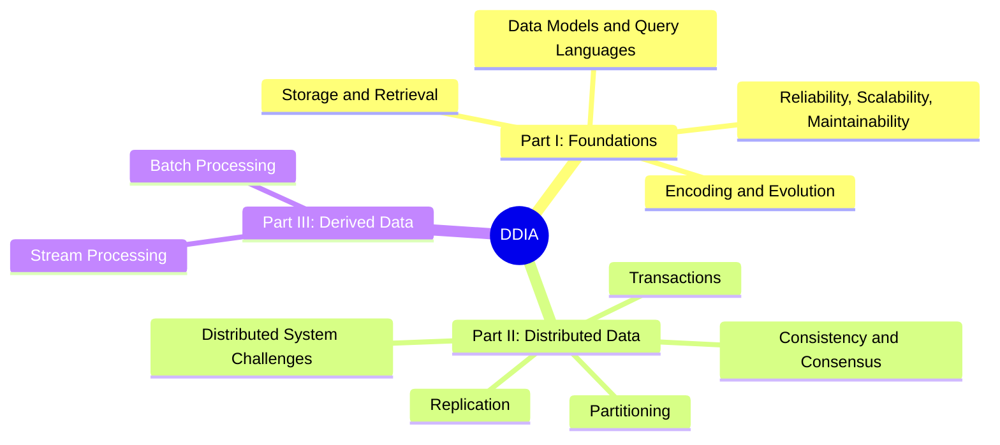

A 19-part series of reading notes on Martin Kleppmann's *Designing Data-Intensive Applications* (DDIA). The book covers the fundamental ideas behind reliable, scalable, and maintainable data systems -- from single-node storage engines to distributed architectures and stream processing pipelines.

These notes follow the book's three-part structure: foundations of data systems, distributed data, and derived data. Each note captures the key concepts, trade-offs, and design patterns from one or two chapters.

---

## Topic Overview

---

## Reading Notes

### Part I: Foundations of Data Systems

1. 
2. 
3. 
4. 
5. 
6. 
7. 
8. 
9. 

### Part II: Distributed Data

10. 
11. 
12. 
13. 
14. 
15. 
16. 
17. 

### Part III: Derived Data

18. 
19. 
