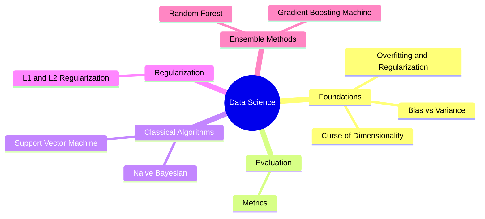

A 9-part series of study notes covering core data science and machine learning concepts. The series starts with foundational topics like overfitting, bias-variance tradeoff, and the curse of dimensionality, then moves into evaluation metrics and classical ML algorithms.

The later notes cover key algorithms in depth -- Support Vector Machines, Naive Bayes, regularization techniques (L1 and L2), and ensemble methods including Random Forest and Gradient Boosting Machines.

---

## Topic Overview

---

## Study Notes

### Foundations

1. 
2. 
3. 

### Evaluation

4. 

### Classical Algorithms

5. 
6. 

### Regularization

7. 

### Ensemble Methods

8. 
9. 
