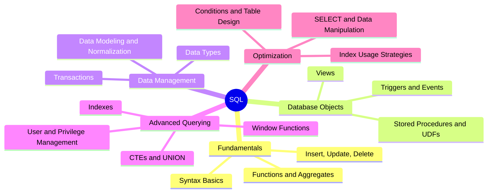

A 16-part series of study notes covering SQL from the ground up. Starting with basic syntax and data manipulation, the series progresses through functions, views, stored procedures, triggers, transactions, data types, data modeling, indexing, user management, CTEs, and window functions.

The final three notes focus on query optimization -- covering index usage strategies, SELECT tuning, data manipulation performance, and best practices for conditions and table design.

---

## Topic Overview

---

## Study Notes

### Fundamentals

1. 
2. 
3. 

### Database Objects

4. 
5. 
6. 

### Data Management

7. 
8. 
9. 

### Advanced Querying

10. 
11. 
12. 
13. 

### Optimization

14. 
15. 
16. 
